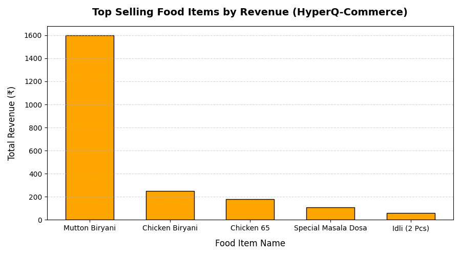

# HyperQ-Commerce Analytics 

An advanced SQL-driven data analytics project designed for a modern **Food Ordering & Delivery System** (similar to Swiggy/Zomato). This repository showcases enterprise-level database design, optimization, and analytical query structures aimed at deriving business insights.

## Business Overview
In the highly competitive food delivery market, understanding platform revenue, identifying high-performing restaurants, evaluating delivery efficiency, and analyzing customer spending behavior are critical for growth. This project builds the backend analytics layer to answer these vital business questions.

---

## Tech Stack & Concepts Demonstrated
- **Database:** MySQL
- **Advanced SQL Techniques:** Multi-table JOINS, Common Table Expressions (CTEs), Conditional Aggregations (`SUM(CASE WHEN...)`).
- **Database Architecture:** Views, Stored Procedures (`LAST_INSERT_ID()`), Custom Triggers/Constraints, and Performance Optimization using **Indexes**.

---

## Project Architecture & Execution Order

To set up and run this project, execute the SQL scripts in the following order:

1. **`01_schema_and_data.sql`** - Creates the core database (`FoodOrderingSystem`) and base tables (`Customer`, `Restaurant`, `FoodItem`, `DeliveryAgent`, `Orders`, `OrderDetails`, `Review`, `Offer`).
   - Populates initial customer records.
   
2. **`02_views.sql`** - Implements core operational views like `vw_DeliveryPerformance` and `vw_FinancialPerformance`.

3. **`03_analysis_queries.sql`** - Raw SQL queries targeting core KPIs (Key Performance Indicators) such as overall revenue and top-selling food items.

4. **`04_indexes_constraints.sql`** - Optimizes query lookup times by adding indexing on frequently filtered columns like `email`, `phone`, and foreign keys.

5. **`05_insert_remaining_data.sql`** - Adds realistic transactional data (Orders, Deliveries, Ratings, Offers) to test the analytical queries.

6. **`06_stored_procedures.sql`** - Contains `sp_PlaceOrder`, an advanced atomic transactional procedure that handles single-item ordering and automatically updates relational details.

7. **`07_analytics_views.sql`** - Encapsulates reporting queries into reusable database views (`vw_TotalPlatformRevenue`, `vw_TopSellingItems`, etc.) for seamless reporting.

---

## Core Business Insights Derived

### 1. Platform Financial Health
- **Total Revenue Generated:** ₹2,200.00 *(Sum of active database transactions)*
- **Top Customer:** *Manojkumar* (Total Spent: ₹1,460.00)

### 2. Product Performance
- **Star Item:** *Mutton Biryani* from Ambur Star Biryani (5 Units Sold, Revenue: ₹1,600.00).

### 3. Vendor Performance
- **Top Rated Restaurant:** *Ambur Star Biryani* (Average Rating: **5.0** based on 2 reviews).

---

## Data Visualization Preview

Here is the automated bar chart generated by extracting database views into Python via SQLAlchemy, showing top-performing food items by platform revenue:



---

## How to Run the Project
1. Open your MySQL Workbench / Command Line Client. 

  To view data directly from the analytical dashboard within SQL, simply run:
  
   SELECT * FROM vw_TopSellingItems;
   SELECT * FROM vw_CustomerSpending;
   
2. Run the files sequentially from `01_schema_and_data.sql` to `07_analytics_views.sql`.

3. Run the Python automated script to preview the report visualization:
```bash
   python 08_data_analysis.py
